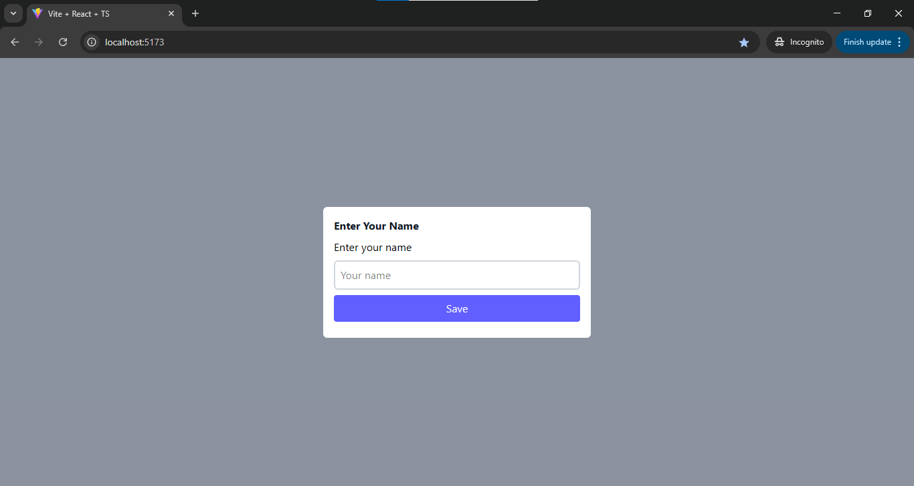
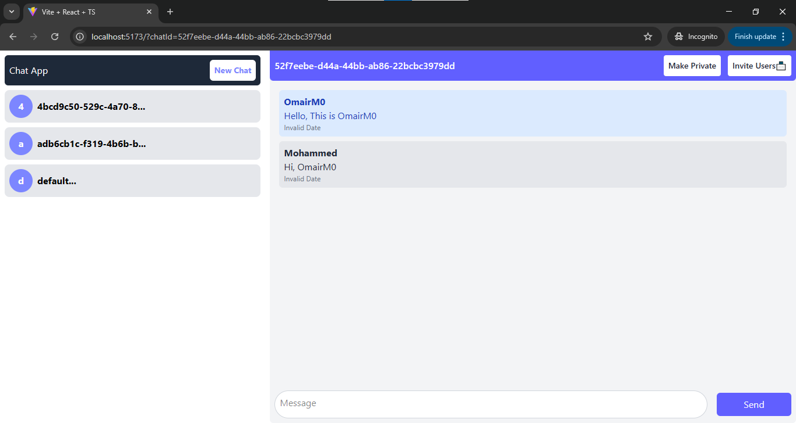
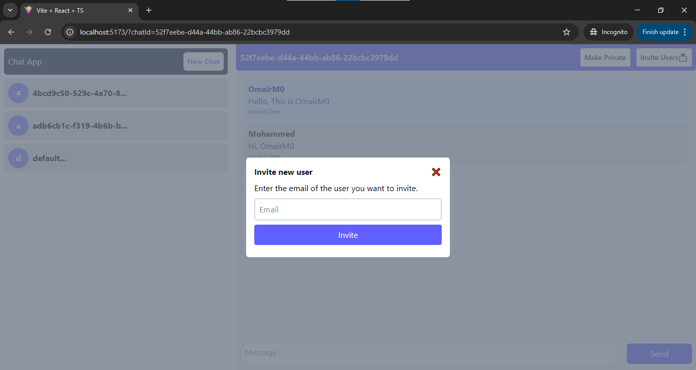

# 💬 Real-Time Chat App

A simple real-time chat application built using **React.js**, **Socket.IO**, and **Express.js**.

## ✨ Features

- 🔐 Realtime communication with WebSockets
- 👤 Login with email and OTP
- 💬 One-to-one and group chat support
- 🧼 Clean and modern UI with Tailwind CSS
- 🔄 Persistent token-based login (localStorage)

## 📸 Screenshots

### 🔑 Login Page

### 🖥️ OTP Interface

### 🖥️ Sender Interface

### 🖥️ Chat Interface

### 🖥️ Group Chat Interface

### 🖥️ Invite User Interface

## 🚀 Technologies Used

### Frontend

- React.js
- Tailwind CSS
- Socket.IO Client

### Backend

- Node.js
- Express.js
- Socket.IO
- Sequelize
